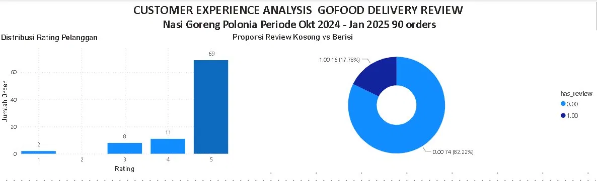
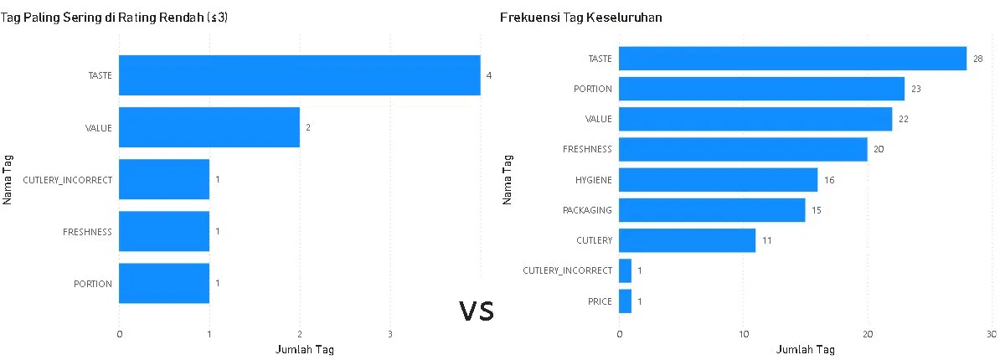
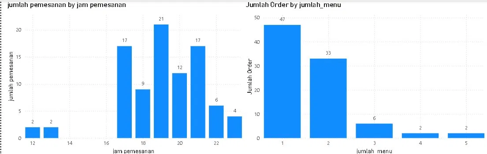
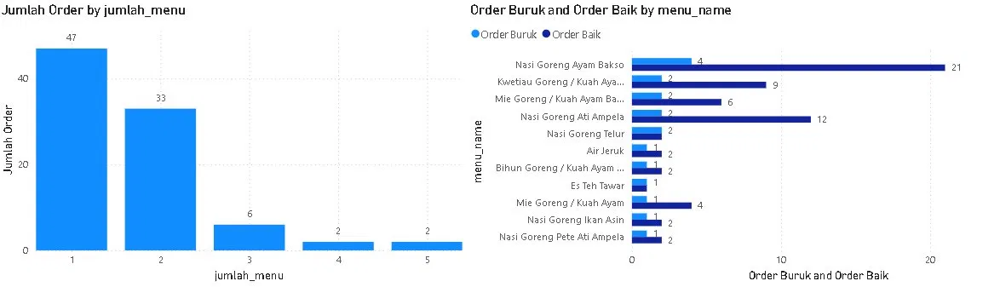

# Customer Experience Analysis – GoFood Delivery Review

Analisis review pelanggan dari 1 restoran (Nasi Goreng Polonia) pada platform GoFood, periode Oktober 2024 hingga Januari 2025.

---

## Latar Belakang

Dataset ini merupakan data review pelanggan GoFood untuk 1 restoran, dengan tipe pesanan delivery saja. Dataset bukan data penjualan — tidak ada harga, quantity, atau revenue. Fokus analisis adalah pada pengalaman pelanggan: rating, review, tag feedback, dan pola pemesanan menu.

## Dataset

- 220 baris raw → dinormalisasi menjadi 3 tabel relasional
- 90 order unik | 149 item menu | 137 tag feedback

Dataset mentah berbentuk menu-per-order (1 baris = 1 menu), dengan duplikasi pada level order karena setiap order tercatat berulang 2-3 kali akibat perubahan struktur export GoFood di tengah periode pengambilan data.

## Struktur Database

Setelah dinormalisasi, data dipecah menjadi 3 tabel relasional untuk menghilangkan redundansi:

- `orders` → 90 baris (level pengalaman pelanggan: 1 baris = 1 order, 1 rating, 1 review)
- `order_items` → 149 baris (level menu per order: 1 baris = 1 menu yang dipesan)
- `order_tags` → 137 baris (level feedback tag per order: 1 baris = 1 tag yang dipilih pelanggan)

Relasi antar tabel:
```
orders (1) ──< order_items (many)   via order_id
orders (1) ──< order_tags (many)    via order_id
```

## Tools

- **Python (pandas)** — normalisasi data dari raw Excel/CSV ke 3 tabel relasional
- **SQLite + DB Browser for SQLite** — penyimpanan data dan query analitik
- **Power BI** — visualisasi dashboard

---

## Insight yang Dianalisis

### A. Kualitas Layanan



**A1 — Distribusi Rating**
Mayoritas pelanggan memberi rating 5 (69 dari 90 order, atau 77%). Hanya 2 order yang memberi rating 1. Ini menunjukkan kepuasan pelanggan secara umum cukup tinggi.

**A2 — Proporsi Review**
82% pelanggan (74 dari 90 order) tidak menulis review meski memberi rating — pola umum di platform delivery di mana rating jauh lebih sering diisi dibanding teks review.



**A3 — Tag pada Rating Rendah**
Pada order dengan rating ≤3, tag TASTE (rasa) paling sering dipilih, diikuti VALUE dan beberapa tag lain dengan frekuensi rendah (total hanya 9 kemunculan dari sedikit order bermasalah).

**A4 — Frekuensi Tag Keseluruhan**
Secara keseluruhan, TASTE tetap menjadi tag paling sering dipilih (28 kali), diikuti PORTION (23) dan VALUE (22). Pola ini konsisten baik di rating rendah maupun rating tinggi — menunjukkan rasa adalah aspek yang paling diperhatikan pelanggan, baik saat puas maupun kecewa.

### B. Operasional Mikro



**B1 — Jam Order Paling Ramai**
Jam 19:00 adalah waktu order tersibuk dengan 21 order, mengindikasikan jam makan malam sebagai peak hour utama restoran ini.

**B2 — Pola Order Multi-Menu**
52% pelanggan (47 dari 90 order) hanya memesan 1 menu per transaksi, 37% memesan 2 menu, dan sisanya memesan 3 menu atau lebih.



**B3 — Menu Paling Sering Dipesan**
Nasi Goreng Ayam Bakso adalah menu terpopuler dengan 27 kali dipesan, diikuti Nasi Goreng Ati Ampela dan Nasi Goreng Special (masing-masing 17 kali).

**B4 — Menu pada Order Buruk vs Baik**
[Isi setelah hasil akhir B4 dikonfirmasi]

---

## Struktur Folder

```
project-sql-gofood/
│
├── data/
│   └── data_review_gofood.xlsx
│
├── assets/
│   ├── dashboard_full.png
│   ├── insight_rating_review.png
│   ├── insight_tag.png
│   ├── insight_operational.png
│   └── insight_menu.png
│
├── normalisasi.py
├── db_order.db
├── queries.sql
└── README.md
```

## Cara Menjalankan

1. Jalankan `normalisasi.py` untuk menghasilkan tabel `orders`, `order_items`, `order_tags` dari dataset mentah
2. Buka `db_order.db` di DB Browser for SQLite untuk eksplorasi data
3. Jalankan query di `queries.sql` untuk mereproduksi seluruh insight
4. Buka dashboard Power BI (file `.pbix`, jika disertakan) untuk melihat visualisasi interaktif
